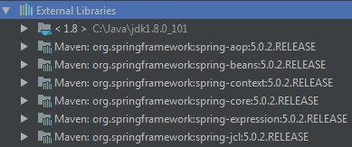

# <a name="Home"></a> Project creation

## Содержание:
- [Обзор](#Overview)
- [Создание Maven проекта](#mvnproject)
- [Подключаем Spring](#addspring)
- [Написание кода](#writecode)

## [↑](#Home) <a name="Overview"></a> Обзор
Официальный сайт Spring Framework: https://spring.io/
На главном сайте в верхнем меню можно открыть список всех проектов, выбрав "Projects".
Нас интересует "ядро" фрэймворка, оно же [Srping Framework core](https://projects.spring.io/spring-framework/).
Как указано на сайте:
```
Core support for dependency injection, transaction management, web applications, data access, messaging, testing and more.
```
То есть предоставляет базовые возможности фрэймворка, знакомство с которыми и является нашей целью.
Тут же доступна в правой части [Reference Documentation](https://docs.spring.io/spring/docs/current/spring-framework-reference/).
Нас интересует её раздел: [Core](https://docs.spring.io/spring/docs/current/spring-framework-reference/core.html#spring-core).

## [↑](#Home) <a name="mvnproject"></a> Создание Maven проекта
Maven - система сборки проектов. Официальный сайт: https://maven.apache.org/
Для быстрого создания проекта есть понятие - [архетип](https://maven.apache.org/archetype/index.html).
Как указано в документации, нам достаточно выполнить команду:
```
mvn archetype:generate
```
Далее следуем указаниям, выдаваемым на экран.
Сначала, нам предложат выбрать фильтр: **"Choose a number or apply filter"**.
Если просто нажать Enter, то мы автоматически согласимся на **:maven-archetype-quickstart**. Оно и не плохо, согласимся.
Примерно такие GAV:
```
Define value for property 'groupId': com.github.vastap
Define value for property 'artifactId': springcore
```
Версию возьмём по умолчанию.
После того, как проект сгенерирован - откроем **pom.xml**.
Например, для артифакта springcore будет springcore\pom.xml
Пример можно посмотреть на официальном сайте maven в разделе ["User centre"](https://maven.apache.org/users/index.html). Нас интересует [POM Reference](https://maven.apache.org/pom.html).

Добавим себе Properties в проект из раздела [Properties](https://maven.apache.org/pom.html#Properties). Версию Java, естественно, поднимаем до 1.8.

Теперь можем импортировать проект в любую удобную IDE, буть то Eclipse или Idea.

## [↑](#Home) <a name="addspring"></a> Подключаем Spring
Как указано на странице [Spring Framework core project](https://projects.spring.io/spring-framework/), рекомендуется начать с подключения зависимости **spring-context**:
```xml
<dependencies>
    <dependency>
        <groupId>org.springframework</groupId>
        <artifactId>spring-context</artifactId>
        <version>5.0.2.RELEASE</version>
    </dependency>
</dependencies>
```
После обновления проекта мы увидим, что мы получили ещё небольшой объём зависимостей, которые пришли вместе со spring-context:

Сразу будем стараться делать правильно. Вынесем версию Spring в блок properties:
```xml
<version.spring>5.0.2.RELEASE</version.spring>
```
А в месте указания версии используем **${version.spring}**.

## [↑](#Home) <a name="writecode"></a> Написание кода
За основу возьмём задание из урока: [Архитектура - 1 - The Basics of Spring Framework](https://youtu.be/3wBteulZaAs?t=5m35s).
Предлагается модифицировать следующим образом класс App:
```java
public class App {
    Client client;
    ConsoleEventLogger eventLogger;

    public static void main(String[] args) {
        App app = new App();

        app.client = new Client("1", "John Smith");
        app.eventLogger = new ConsoleEventLogger();

        app.logEvent("Hello World from user 1!");
    }

    public void logEvent(String msg) {
        String message = msg.replaceAll(client.getId(), client.getFullName());
        eventLogger.logEvent(message);
    }
}
```
А так же написать классы:
```java
public class Client {
    private String id;
    private String fullName;

    public Client(String id, String fullName) {
        this.id = id;
        this.fullName = fullName;
    }

    // Геттеры и сеттеры для id и fullName
}
```
и
```java
public class ConsoleEventLogger {

    public void logEvent(String msg) {
        System.out.println(msg);
    }
}
```
В таком виде предстаёт перед нами наш прототип, который мы будем изменять.